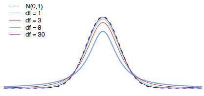

```{r setup, include=FALSE}
knitr::opts_chunk$set(echo = TRUE)
library(stats250sbi)
```

# Lab Notes

Use this place to take any notes during your lab section.

- Type any notes here
- Add new notes by using the dash `-` to create a list

# Learning Objectives

## R Learning Objectives
1. Create a graphical display of the $t$ distribution.
1. Interpret R output providing confidence intervals and hypothesis tests for inference on population means.

## Statistical Learning Objectives
1. Learn about the $t$ distribution
1. Get experience making confidence intervals for population means
1. Understand hypothesis tests for population means

## Functions Covered in this Lab
1. `plot_t()`
1. `pt()`
1. `qt()`
1. `t.test()`
1. `subset()`

# Lab Tutorial

## One Population Mean 
This week, we are shifting our focus from categorical data (proportions) to *numeric* data (means). Inference for one mean is a new tool in our statistical toolkit that will let us answer different questions about data. Keep in mind that the parameter we're interested in now is **$\mu$** (mu), the population mean. 

## The $t$ Distribution
Recall from lecture that the **$t$ distribution**, like the standard normal distribution ($N(0, 1)$) that we've seen before, is symmetric about zero and bell-shaped. 

The $t$ distribution, however, has "thicker" ("heavier") tails than the normal distribution. This is so that we can account for the increased uncertainty introduced when we use the sample standard deviation $s$ to estimate the population standard deviation $\sigma$.

## The $t$ Distribution
The $t$ distribution is a "family" of distributions, meaning there are an infinite number of $t$ distributions. The same is true of the normal distribution -- there are infinite different normal distributions. 

We describe which normal distribution we need to specify two parameters, the mean $\mu$ and the standard deviation $\sigma$. 

We identify which  $t$ distribution we're talking about using just one parameter, the **degrees of freedom (df)**.

## $t$ Distribution Versus the Standard Normal Distribution

As the degrees of freedom increase, the $t$ distribution gets closer and closer to a standard normal distribution, $N(0, 1)$:



## Graphing the $t$ Distribution
We can  use the `plot_t()` function in the `stats250sbi` package to make a graphical display of the $t$ distribution. As you might expect, `plot_t()` is similar to `plot_norm()`.

Arguments to send to `plot_t()`:

- `df`: This is the degrees of freedom for the sample; this week, we can find `df` by computing $n - 1$, where $n$ is the sample size.
- `shadeValues`: This is the value(s) that we wish to identify, and shade either to the left or to the right of. To include two values we will combine them by using the `c()` function.
- `direction`: This is the direction to shade. The choices are: "less", "greater", "beyond", "between". The text must be written in double quotes. 
- `col.shade`: Optional color choice for the graph.

## Recall an Example from Lecture

In lecture, you worked with data from a random sample of 53 female ring-tailed lemurs at the Duke Lemur Center in North Carolina. The question was whether the average weight for female ring-tailed lemurs differs from the 2213 gram average weight for female ring-tailed lemurs in the wild.

Our hypotheses were 
$$H_0: \mu = 2213 \text{ and } H_A: \mu \neq 2213$$

The test statistic for that example was 
$$t = \frac{\bar x - \mu _0}{\frac{s}{\sqrt{n}}} = \frac{2406.6 - 2213}{\frac{378.7}{\sqrt{53}}} = 3.722$$

## Graphing the $t$ Distribution 

\small
The p-value for this hypothesis test is the area in both tails of the $t(52)$ distribution.

```{r, out.width = "75%", fig.align = "center"}
plot_t(3.722, df = 53, 
       shadeValues = c(-3.722, 3.722), 
       direction = "beyond")
```


## Finding Probabilites Under a $t$ Distribution
We can find probabilities related to the $t$ distribution using the `pt()` function. The `pt()` function is analogous to the `pnorm()` function we used with normal distributions.

Arguments to send to `pt()`:

- `q`: The observation is sometimes called a **quantile**, thus the **q** notation. 
- `df`: This is the degrees of freedom for the sample; this week, we can find `df` by computing $n - 1$, where $n$ is the sample size.
- `lower.tail`: By default, this argument is set to `TRUE`, meaning that we *want* the lower tail (i.e., to shade to the left). If we *don't want* the lower tail, and we actually want the *upper* tail (i.e., to shade to the right), we should set this to `FALSE`.

The mean of a $t$ distribution is 0, and the standard deviation of a $t$ distribution is a function of the the degrees of freedom, so we *don't* need to specify the mean and the standard deviation to use `pt()`.

## Using `pt()` to Find a p-value

The p-value for the lemur example from lecture was approximately 0.0005. How would we have calculated that if it had not been in the R output for the hypothesis test?

Our test statistic is $t$ = 3.722, the degrees of freedom are $df = n - 1 = 52$, and we had a two-sided alternative. Let's calculate the p-value in the `lemur_pvalue` code chunk in your notes. Don't forget to specify the value of the test statistic and the degrees of freedom.

```{r lemur_pvalue, echo = TRUE}
2*pt(q =  , df =  , lower.tail = FALSE)
```


## Finding the Quantile on a $t$ Distribution
Also, we can use `qt()` to get quantiles of the $t$ distribution. The `qt()` function will be helpful to find $t^*$ critical values needed for confidence intervals for means.

Arguments to send to `qt()`:

- `p`: The probability to the **left by default** of the quantile we wish to find. If we want the probability to the *right*, we should tinker with `lower.tail` as specified below.
- `df`: This is the degrees of freedom for the sample; this week, we can find `df` by computing $n - 1$, where $n$ is the sample size.
- `lower.tail`: By default, this argument is set to `TRUE`, meaning that we *want* the lower tail (i.e., to shade to the left). If we *don't want* the lower tail, and we actually want the *upper* tail (i.e., to shade to the right), we should set this to `FALSE`.

## Back to the Penguins!
Run the `loadPenguins` code chunk below so that we can use the penguins data set.

```{r loadPenguins, echo = FALSE}
penguins <- read.csv("penguins.csv", stringsAsFactors = TRUE)
```

Let's say we want to construct a confidence interval for the population mean flipper length of penguins living in the Palmer Archipelago, or conduct a hypothesis test for that mean. 

In order to use our technology for constructing confidence intervals and performing hypothesis tests for means, we need two conditions to hold. **What are they?**

## Conditions for a CI or HT for the Population Mean
The conditions are

1. The observations must be *independent* of one another. 
2. When the sample is small, we require that the *sample observations come from a normally distributed population*. We can relax this condition more and more for larger and larger sample sizes.

How can we check that we meet both of these conditions?

## Checking the Conditions for a CI or HT for the Population Mean
To check the conditions:

1. Verify that we have taken a random sample from the population. If we don't have a random sample, we should consider whether it's reasonable or not to believe that the observations are independent of one another.
2. Examine a histogram of the sample data. When the sample is small, we require that the sample observations come from a normally distributed population. We can relax this condition more and more for larger and larger sample sizes.

\footnotesize
Saying "small $n$" and "large $n$" is still vague, so here are a few guidelines:

- slight skew is okay for sample sizes up to about 15
- moderate skew is okay for sample sizes up to about 30
- strong skew is okay for sample sizes of about 60 or more

## Are the Observations for the Penguins Data Set Independent of One Another?
Do you think that the penguins data is from a random sample? If not, do you think that the observations of penguins are independent of one another?

*write your answer to the independence check here*

\small
**Note:** Checking independence typically means that we need to know how the data was collected. If you're doing your own research, you'll do what you can to make sure of this. For the purposes of PSTAT 5LS, Prof Miller will tell you that the data are from a random sample or that the independence condition is satisfied.

## Are Penguin Flipper Lengths Normally Distributed?
Let's make a histogram in the `flipperHist` code chunk of your notes document of the penguin flipper length. (Don't forget to first run the chunk to read in the data!)

Do you think that the distribution is approximately bell-shaped?

## Histogram of Penguin Flipper Lengths
```{r flipperHist, echo = FALSE}
hist(penguins$flipper_length_mm,
     main = "Histogram of Flipper Length",
     xlab = "Flipper length (mm)",
     col = "#09847A")
```

## Dealing with a Bimodal Distribution

In lecture, Professor Miller has talked about bimodal distributions being indicative of subgroups. Flipper length differs for the three species of penguins, so we need to look at them individually. 

For the purpose of our work in this lab, we will work the flipper lengths for the Gentoo penguins. 

## Subsetting the Data

Run the `gentoo_subset` code chunk below to create a data set with only the 119 Gentoo penguins.

```{r gentoo_subset, error = T}
gentoo <- subset(penguins, penguins$species == "Gentoo")

```

Note that the Environment pane now has `gentoo` listed.

## Create a Histogram to Examine the Distribution

Let's examine the flipper lengths for the Gentoo penguins in the `flipperHistGentoo` code chunk. Be sure to specify your variable and a label for the x-axis (we've taken care of the title for you).

```{r flipperHistGentoo, echo = FALSE, out.width = "80%", fig.align = "center"}
hist( ,
     main = "Histogram of Flipper Length for Gentoo Penguins",
     xlab =  ,
     col = "#09847A")
```


## Checking Normality

Use the histogram you created to check the normality condition. Does it appear that the flipper lengths for the Gentoo penguins came from a normally distributed population. If not, what can we do?

## Checking Normality

The histogram of flipper lengths for the Gentoo penguins is unimodal and slightly skewed to the right. Skew does not impact larger data sets as much as it does smaller data sets. Since 119 is a large sample, we can relax the normality condition. 

(The reason we can relax the normality condition is that the Central Limit Theorem tells us that the sampling distribution of the sample mean $\bar x$ flipper length will be approximately normal.)

## Creating a Confidence Interval for the Mean Flipper Length
Let's construct a 95% confidence interval for the population mean flipper length of Gentoo penguins living in the Palmer Archipelago. 

Just like `prop_test()`, we can give `t.test()` the relevant information and have R compute the confidence interval for the mean flipper length. 

**Note:** We must have the data to run `t.test()`. If we only have summary statistics, we need to construct the confidence interval by hand (using R to find the $t^*$ value.)

## Creating a Confidence Interval for the Mean Flipper Length

Since we only want a confidence interval (we are not doing a hypothesis test), we do not need to specify a hypothesized mean (we don't have one!). We do have to specify the confidence level. Try this code out in the `flipper_length_CI` code chunk in your notes document (be sure to specify `conf.level`).

\scriptsize
```{r flipper_length_CI}
t.test(gentoo$flipper_length_mm, conf.level = 0.95)
```
\normalsize
Let's interpret this confidence interval in context.

## Confidence Interval Interpretation for One Mean
We estimate with 95% confidence that the mean flipper length for all Gentoo penguins in the Palmer Archipelago is between 216.04 mm and 218.43 mm.

(This interval gives a range of reasonable values for the mean flipper length for all Gentoo penguins in the Palmer Archipelago.)

## Hypothesis Test for a Mean
We can also use `t.test()` to help us run a hypothesis test about a population mean. As with confidence intervals, we can only use `t.test()` if we have the data in R (if we don't, we need to calculate the test statistic from the summary statistics and then use `pt()` to find the p-value). 

## Hypothesis Test for a Mean

Let's consider this scenario. According to Australia's Department of Climate Change, Energy, the Environment and Water, Gentoo penguins have an average flipper length of 230 mm. Is the average flipper length for the Gentoo penguins living on Palmer Archipelago different? Use $\alpha = 0.05$.

Thus we are testing:

$H_0: \mu = 230$ 

$H_a: \mu > 230$

where $\mu$ is the mean flipper length in the population of Gentoo penguins living in the Palmer Archipelago.

## Using `t.test()` to Run this Hypothesis Test

Since we have the data in R, let's use `t.test()` to run the hypothesis test. 

Try this code out in the `flipper_length_HT` code chunk in your notes document. Make sure to specify the hypothesized mean in the `mu` argument and the alternative in the `alternative` argument ("two.sided", "less", "greater"). (Note that we don't have to specify `conf.level` for a hypothesis test.)
\scriptsize
```{r flipper_length_HT}
t.test(gentoo$flipper_length_mm, 
       mu =  , 
       alternative =  )
```
\normalsize

## To Reject or Not to Reject? 

When R reports a p-value of < 2.2e-16, it is telling us that the p-value is less than $2.2 \times 10^{-16}$. In other words, the p-value is close to zero. Because our p-value is less than the significance level of 0.05, we reject the null hypothesis.

## Conclusion for the Hypothesis Test

We've decided to reject the null hypothesis, so what's the conclusion?

*replace this with your conclusion*

# Code Cheat Sheet

## `pt(q, df, lower.tail = TRUE)`

- `q` is the x-axis value you want to find an area related to
- `df` is the degrees of freedom of the $t$ distribution
- `lower.tail` determines whether `pt()` finds the area to the left or right of `q`. If `lower.tail = TRUE` (the default), it shades to the left. If `lower.tail = FALSE`, it shades to the right.
  
## `qt(q, df, lower.tail = TRUE)`

- `p` is the probability or area under the curve you want to find an x-axis value for
- `df` is the degrees of freedom of the $t$ distribution
- `lower.tail` determines whether `pt()` finds the area to the left or right of `q`. If `lower.tail = TRUE` (the default), it shades to the left. If `lower.tail = FALSE`, it shades to the right.
  
## `plot_t()`

- `df` refers to the degrees of freedom of the distribution to plot. You must provide this value.
- `shadeValues` is a vector of up to 2 numbers that define the region you want to shade
- `direction` can be one of `less`, `greater`, `beyond`, or `between`, and controls the direction of shading between `shadeValues`. Must be `less` or `greater` if `shadeValues` has only one element; `beyond` or `between` if two
- `col.shade` controls the color of the shaded region, defaults to `"cornflowerblue"`
- `...` lets you specify other graphical parameters to control the appearance of the normal curve (e.g., `lwd`, `lty`, `col`, etc.)

## `t.test(x, alternative, mu, conf.level)`
- `x` is a vector of data values
- `alternative` specifies the direction of the alternative hypothesis; must be one of "two.sided", "less", or "greater"
- `mu` indicates the true value of the mean (under the null hypothesis); defaults to 0
- `conf.level` is the confidence level to be used in constructing a confidence interval; must be between 0 and 1, defaults to 0.95

## Important plotting arguments

### `main = "Title of Your Graph in Double Quotes"`

- graph title that must be inside a set of double quotes

### `xlab = "x-axis Label of Your Graph in Double Quotes"`

- the x- (horizontal) axis label that must be inside a set of double quotes

### `ylab = "y-axis Label of Your Graph in Double Quotes"`

- the y- (vertical) axis label that must be inside a set of double quotes
